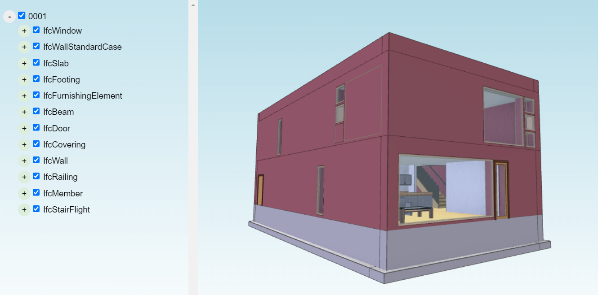

# xeokit-sdk

[](https://badge.fury.io/js/%40xeokit%2Fxeokit-sdk)
[](https://www.jsdelivr.com/package/npm/@xeokit/xeokit-sdk)
[](/advisor/npm-package/@xeokit/xeokit-sdk)
[](https://github.com/xeokit/xeokit-sdk/actions/workflows/codesee-arch-diagram.yml)

[xeokit](http://xeokit.io) is a JavaScript software development kit created by [xeolabs](http://xeolabs.com) and supported by [Creoox AG](https://creoox.com) for viewing
high-detail, full-precision 3D engineering and BIM models in the browser.

## Resources

* [xeokit.io](https://xeokit.io/)
* [Examples](http://xeokit.github.io/xeokit-sdk/examples/)
* [Guides](https://www.notion.so/xeokit/xeokit-Documentation-4598591fcedb4889bf8896750651f74e)
* [API Docs](https://xeokit.github.io/xeokit-sdk/docs/)
* [Features](https://xeokit.io/index.html?foo=1#features)
* [Changelog](https://github.com/xeokit/xeokit-sdk/blob/master/CHANGELOG.md)
* [FAQ](https://xeokit.io/#faq)
* [License](https://xeokit.io/#pricing)

---
If you are interested in a **ready-to-use 3D/BIM Viewing Ecosystem for Your Own Solution**, be sure to also check out:
* [xeoVision - view your models now!](https://xeo.vision/)
* [xeoServices](https://docs.xeo.vision/)
---

## Installing

````bash
npm i @xeokit/xeokit-sdk
````

## Usage

The xeokit SDK lets us develop our own browser-based BIM viewer, which we can fully customize and extend with
plugins. Let's create a [Viewer](https://xeokit.github.io/xeokit-sdk/docs/class/src/viewer/Viewer.js~Viewer.html) with
a [XKTLoaderPlugin](https://xeokit.github.io/xeokit-sdk/docs/class/src/plugins/XKTLoaderPlugin/XKTLoaderPlugin.js~XKTLoaderPlugin.html)
to view an XKT model in the browser, which was pre-converted from IFC model from
the [Open IFC Model Database](http://openifcmodel.cs.auckland.ac.nz/Model/Details/274).

This is just one way to load our models into xeokit: by converting it to XKT and loading via XKTLoaderPlugin.
We can also load models from other formats directly, 
including [CityJSON](https://xeokit.github.io/xeokit-sdk/docs/class/src/plugins/CityJSONLoaderPlugin/CityJSONLoaderPlugin.js~CityJSONLoaderPlugin.html), 
[glTF](https://xeokit.github.io/xeokit-sdk/docs/class/src/plugins/GLTFLoaderPlugin/GLTFLoaderPlugin.js~GLTFLoaderPlugin.html), 
[LAZ](https://xeokit.github.io/xeokit-sdk/docs/class/src/plugins/LASLoaderPlugin/LASLoaderPlugin.js~LASLoaderPlugin.html) 
and [OBJ](https://xeokit.github.io/xeokit-sdk/docs/class/src/plugins/OBJLoaderPlugin/OBJLoaderPlugin.js~OBJLoaderPlugin.html).

[Run this example](https://xeokit.github.io/xeokit-sdk/examples/buildings/#xkt_vbo_Duplex)




````html
<!doctype html>
<html>
<head>
    <meta charset="utf-8">
    <meta http-equiv="X-UA-Compatible" content="IE=edge,chrome=1">
    <meta name="viewport" content="width=device-width, initial-scale=1">
    <title>xeokit Example</title>
    <style>
        body {
            margin: 0;
            width: 100%;
            height: 100%;
            user-select: none;
        }

        #xeokit_canvas {
            width: 100%;
            height: 100%;
            position: absolute;
            background: lightblue;
            background-image: linear-gradient(lightblue, white);
        }
    </style>
</head>
<body>
<canvas id="xeokit_canvas"></canvas>
</body>
<script id="source" type="module">

    import {XKTLoaderPlugin, Viewer} from
                    "https://cdn.jsdelivr.net/npm/@xeokit/xeokit-sdk/dist/xeokit-sdk.es.min.js";
    
    const viewer = new Viewer({
        canvasId: "xeokit_canvas",
        transparent: true,
        dtxEnabled: true
    });

    viewer.camera.eye = [-3.933, 2.855, 27.018];
    viewer.camera.look = [4.400, 3.724, 8.899];
    viewer.camera.up = [-0.018, 0.999, 0.039];

    const xktLoader = new XKTLoaderPlugin(viewer);

    const sceneModel = xktLoader.load({
        id: "myModel",
        src: "Duplex.xkt",
        saoEnabled: true,
        edges: true,
        dtxEnabled: true
    });
    
</script>
</html>
````
---
## 📜 Licensing & Commercial Use

xeokit SDK is licensed under **AGPLv3**, which requires that any modifications or integrations of xeokit SDK into a project must also be open-sourced under AGPLv3.

🪧 **Need a commercial license?** If your company requires xeokit SDK under a different licensing model for **proprietary or closed-source** applications, we offer **flexible commercial licensing options**.

📩 **Contact us** at [contact@creoox.com](mailto:contact@creoox.com) or visit [xeokit.io](https://xeokit.io/#pricing) for more information.
